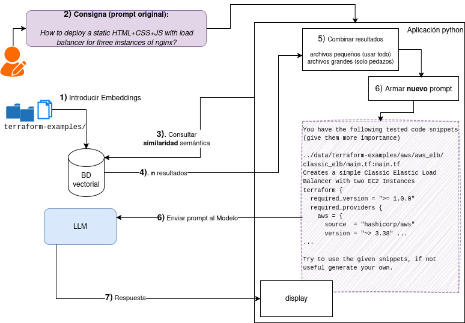

# Generación y consultas de soluciones usando LLM + búsqueda en código local

Usando un modelo de lenguage extenso (LLM) mediante RAG + prompt engineering, busca en un directorio código local para utilizar su contenido y pasarselo al LLM generativo junto con una **petición inicial** del usuario.

- Notebook: [notebooks/p1.ipynb](p1.ipynb) usa ejemplos de terraform (prompt en inglés)

## Ejemplos usados

Para este proyecto se usan los ejemplos https://github.com/ContainerSolutions/terraform-examples con código en terraform. 

LICENCIA: MIT

